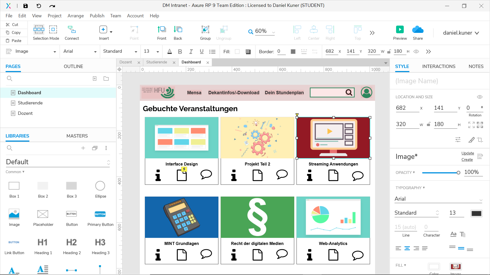
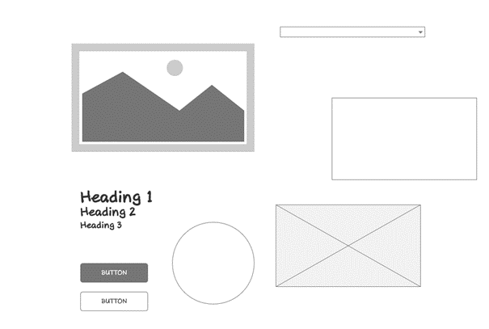
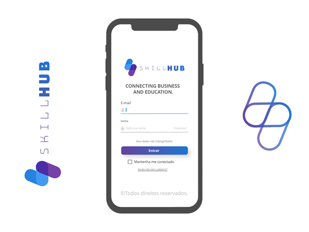
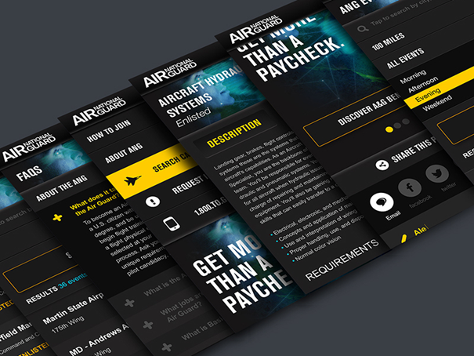
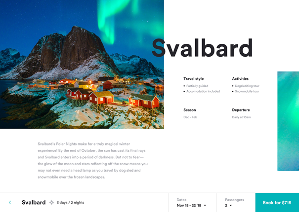
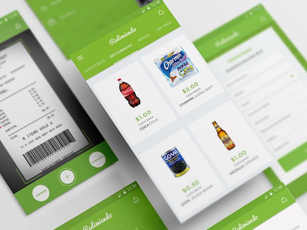

# Aufgabe 2.1: Vorstellung von Axure RP9

von Daniel Oliveira und Daniel Kuner

## Allgemeine Beschreibung

Axure RP9 ist ein Tool zur Erstellung von interaktiven Webseiten- und App Prototypen, aber auch Wireframes.

## Kernfeatures

* Sehr leistungsfähiges Tool
* Interaktivität
* Widget- und Icon Bibliotheken
* Kunde kann Link erhalten, um den Prototypen direkt zu testen
* Importieren von Dateien (z.B. aus Sketch)
* AxureShare zur Veröffentlichung des Prototypen

## AxureShare

* Cloudbasierte Teilung des Prototypen
* Kostenlos für bis zu 1000 Projekte

## Arbeiten mit Axure

* Großer Arbeitsbereich in der Mitte
* Links, rechts und unten sind Werkzeuge, Einstellungen und Hilfsmittel
* Master → Zentrale Änderung für den kompletten Canvas
* Adaptive views
* Flyout Menüs
* Dynamic Panels → klickbare und interaktive Inhalte (Drag and Drop, Bilderslider, Akkordeon, Menüs
* Gruppierung
* Simulierung von Formularfeldern →  z.B. Überprüfung auf falsche E-Mail oder Kreditkartennummer
* Für Widgets gibt es Anmerkungs- und Kommentarfelder, welche für die Ausgabe einer Dokumentation sinnvoll sind → für den Entwickler sinnvoll, damit der Entwurf korrekt umgesetzt werden kann
* Widget Libraries: Bootstrap, Minimorning Web UI, Widget Lib, etc.
* Webfonts
* Verschiedene Icon Bibliotheken

## Komplexität / Grenzen

* Ein sehr komplettes Tool, mit sehr vielen Möglichkeiten und Freiheiten
* Simple Prototypen können einfach erstellt werden
* Je umfangreicher und interaktiver der Prototyp werden soll, desto komplexer wird Axure
* Als Gratis Version nur 30 Tage kostenlos, danach 25 bzw. 42 Euro pro Monat
* Für Studenten mindestens ein Jahr kostenlos

## Fidelity

### Interaktivität

Bereitstellung eines Online Prototyps und die Möglichkeit für den Kunden darin zu navigieren und call to actions auszuprobieren. Aber auch low Fidelity Prototypen mit Platzhaltern sind ganz einfach umsetzbar.

### Visuals

Vielfältige Designmöglichkeiten mit Grafik- und Icon Bibliotheken, um den Prototypen so nahe wie möglich an die endgültige Webseite herankommen zu lassen.

### Content

Von Bilder über Texte bis hin zu Menüstrukturen oder Buttons ist alles möglich

## Beispiele von Dribbble

